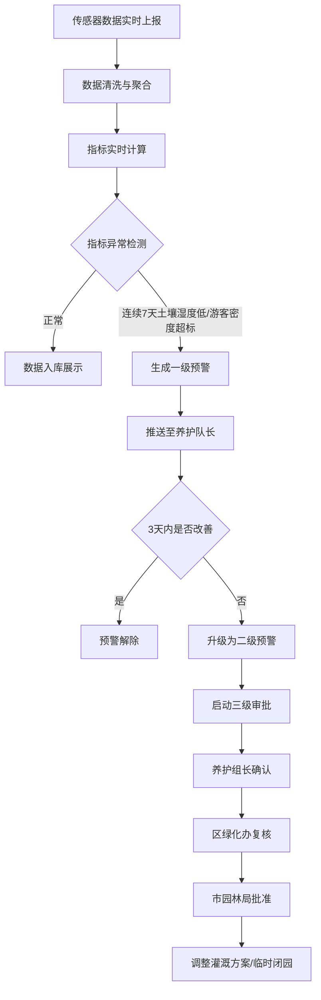

## 1. 产品概述

全国性城市公共绿地与园林养护智能分析平台，实时接入各城市绿地土壤墒情、植物生长监测、灌溉系统、游客流量及养护人员打卡数据，实现数据自动清洗、多维聚合分析、智能预警推送和养护方案推荐，为园林管理部门提供全链路数字化养护决策支持。

- 解决传统绿地养护数据分散、预警滞后、审批流程低效的问题
- 面向国家/省/市三级园林管理部门，实现管辖范围内养护数据实时可见、风险提前预警、决策智能辅助

## 2. 核心功能

### 2.1 用户角色

| 角色 | 注册方式 | 核心权限 |
|------|----------|----------|
| 国家级管理员 | 系统分配 | 查看全国所有省市绿地数据、统计报表、审批二级预警 |
| 省级管理员 | 系统分配 | 查看所辖省份绿地数据、统计报表、审批二级预警 |
| 市级管理员 | 系统分配 | 查看所辖城市绿地数据、统计报表、审批二级预警 |
| 区绿化办 | 系统分配 | 复核二级预警、查看辖区养护明细 |
| 养护组长 | 系统分配 | 确认一级预警、查看所辖公园养护任务 |
| 养护队长 | 系统分配 | 接收一级预警推送、执行养护方案 |

### 2.2 功能模块

1. **核心看板页**：全国绿地健康热力图、养护效率排名、关键指标概览（健康指数/灌溉效率/游客承载率/养护响应率）、省份/公园类型筛选切换
2. **公园详情页**：各片区近7天植被长势趋势曲线、养护成本分布图、土壤墒情实时数据、灌溉系统状态、游客流量监控
3. **预警管理中心**：一级/二级预警列表、预警详情、三级审批流程（养护组长确认→区绿化办复核→市园林局批准）、预警升级自动追踪
4. **养护计划页**：年度养护计划Excel上传、自动提取养护节点、90天绿地生长风险预测、最优浇灌频次和修剪方案推荐
5. **诊断报告页**：每周自动生成绿地养护诊断报告、健康指数同比环比、养护成本趋势、游客满意度、优化建议

### 2.3 页面详情

| 页面名称 | 模块名称 | 功能描述 |
|----------|----------|----------|
| 核心看板 | 关键指标卡片 | 实时展示全国绿地健康指数、灌溉效率、游客承载率、养护响应及时率 |
| 核心看板 | 绿地健康热力图 | 全国地图热力图展示各省市绿地健康状况，支持省份切换 |
| 核心看板 | 养护效率排名 | 各城市/公园养护效率排行榜，支持公园类型筛选 |
| 核心看板 | 筛选切换器 | 按省份、公园类型（综合公园/社区公园/专类公园/带状公园）切换视图 |
| 公园详情 | 片区植被长势 | 近7天各片区NDVI植被指数趋势折线图 |
| 公园详情 | 养护成本分布 | 饼图/柱状图展示各片区养护成本占比 |
| 公园详情 | 土壤墒情 | 实时土壤湿度、温度数据展示与历史曲线 |
| 公园详情 | 灌溉系统 | 灌溉设备在线状态、用水量统计 |
| 公园详情 | 游客流量 | 当日游客数、密度、承载率实时监控 |
| 预警管理 | 预警列表 | 一级/二级预警分tab展示，含预警公园、类型、时间、状态 |
| 预警管理 | 审批流程 | 三级审批流程可视化：养护组长确认→区绿化办复核→市园林局批准 |
| 预警管理 | 预警升级追踪 | 自动检测3天未改善的一级预警，升级为二级并启动审批 |
| 养护计划 | 计划上传 | Excel文件上传，自动解析养护节点 |
| 养护计划 | 风险预测 | 未来90天绿地生长风险预测热力图 |
| 养护计划 | 方案推荐 | 基于历史数据和预测结果推荐最优浇灌频次和修剪方案 |
| 诊断报告 | 报告列表 | 按周展示历史报告列表 |
| 诊断报告 | 报告详情 | 健康指数同比环比、养护成本趋势图、游客满意度评分、优化建议 |

## 3. 核心流程

### 3.1 数据采集与聚合流程
各城市绿地传感器实时上报土壤墒情、植物生长、灌溉、游客流量及养护人员打卡数据 → 数据清洗引擎自动过滤异常值并补全缺失值 → 按行政区、公园类型分类聚合 → 实时计算四大指标（绿地健康指数/灌溉效率/游客承载率/养护响应及时率）

### 3.2 预警生成与升级流程
实时监测指标 → 连续7天土壤湿度低于阈值 或 游客密度超标 → 自动生成一级预警推送至养护队长 → 3天内未改善 → 自动升级为二级预警 → 启动三级审批流程（养护组长确认 → 区绿化办复核 → 市园林局批准）→ 调整灌溉方案或启动临时闭园

### 3.3 养护计划上传与推荐流程
上传年度养护计划Excel → 系统自动提取各区域养护节点 → 结合历史数据预测未来90天绿地生长风险 → 自动推荐最优浇灌频次和修剪方案

## 4. 用户界面设计

### 4.1 设计风格
- **主色调**：深森林绿（#1B4332）为主色，翠绿（#2D6A4F）为辅助色，金色（#D4A574）为强调色
- **背景色**：深色主题，深灰绿（#0D1B16）为背景，营造专业数据监控氛围
- **按钮风格**：圆角8px，主按钮实心填充，次按钮描边风格
- **字体**：数据展示使用等宽字体 JetBrains Mono，正文使用思源黑体/Noto Sans SC
- **布局风格**：左侧固定导航栏 + 顶部信息栏 + 主内容区，卡片式布局
- **图标风格**：线性图标（Lucide），自然生态主题

### 4.2 页面设计概览

| 页面名称 | 模块名称 | UI元素 |
|----------|----------|--------|
| 核心看板 | 关键指标卡片 | 4个数据卡片，渐变背景，数字大字展示，趋势箭头 |
| 核心看板 | 绿地健康热力图 | 中国地图SVG，省域热力着色，hover显示详情弹窗 |
| 核心看板 | 养护效率排名 | 横向柱状图，前10名城市，带排名徽章 |
| 核心看板 | 筛选器 | 顶部下拉选择器，省份+公园类型联动筛选 |
| 公园详情 | 植被长势趋势 | 多线折线图（Chart.js），7天时间轴，各片区对比 |
| 公园详情 | 养护成本分布 | 环形图+列表，成本分类着色 |
| 公园详情 | 实时数据面板 | 数值仪表盘样式，带进度环 |
| 预警管理 | 预警列表 | 表格+状态标签，一级橙色/二级红色 |
| 预警管理 | 审批流程 | 步骤条组件，3步审批节点，带操作按钮 |
| 养护计划 | 上传区 | 拖拽上传区域，虚线边框，上传进度条 |
| 养护计划 | 风险预测 | 日历热力图，90天风险等级着色 |
| 养护计划 | 方案推荐 | 卡片列表，推荐方案参数+适用范围 |
| 诊断报告 | 报告列表 | 卡片式列表，周标题+关键指标摘要 |
| 诊断报告 | 报告详情 | 同比环比柱状图+折线趋势+满意度评分+建议列表 |

### 4.3 响应式设计
- 桌面优先设计，最小支持1280px宽度
- 看板页面1920px最佳体验
- 平板端（768-1024px）侧边栏折叠为图标模式
- 移动端暂不单独适配

## 4.4 3D场景说明
不适用
