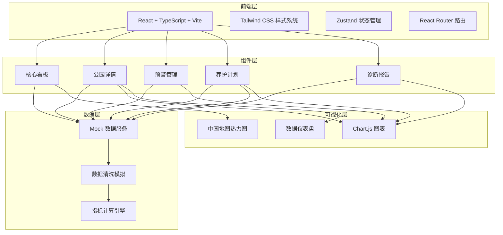
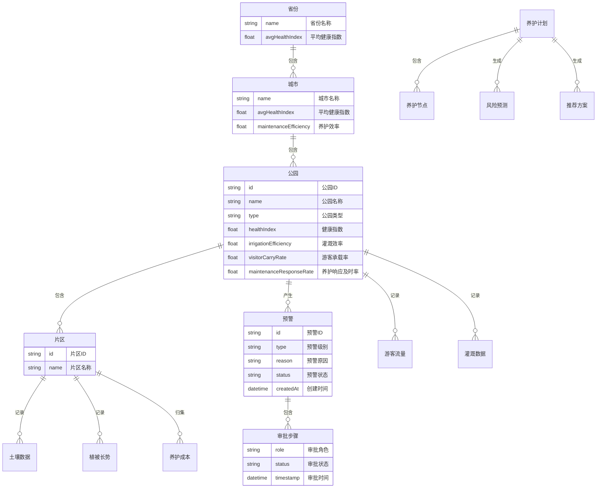

## 1. 架构设计



## 2. 技术说明

- **前端**：React@18 + TypeScript + Tailwind CSS@3 + Vite
- **初始化工具**：vite-init（react-ts 模板）
- **后端**：无（纯前端项目，使用 Mock 数据）
- **数据库**：无（使用内存 Mock 数据模拟）
- **图表库**：Chart.js + react-chartjs-2
- **地图**：自定义 SVG 中国地图组件
- **状态管理**：Zustand
- **路由**：React Router DOM v6
- **图标**：lucide-react
- **文件上传解析**：xlsx（SheetJS）

## 3. 路由定义

| 路由 | 用途 |
|------|------|
| / | 核心看板，全国绿地健康热力图和关键指标概览 |
| /park/:id | 公园详情，下钻查看片区植被长势、养护成本等 |
| /alerts | 预警管理中心，预警列表和审批流程 |
| /plan | 养护计划管理，上传Excel和智能推荐 |
| /reports | 诊断报告列表和详情 |

## 4. API定义

本项目为纯前端项目，使用 Mock 数据模拟以下数据接口：

```typescript
interface GreenSpaceMetrics {
  healthIndex: number
  irrigationEfficiency: number
  visitorCarryRate: number
  maintenanceResponseRate: number
}

interface ParkData {
  id: string
  name: string
  city: string
  province: string
  type: '综合公园' | '社区公园' | '专类公园' | '带状公园'
  metrics: GreenSpaceMetrics
  soilMoisture: number
  visitorDensity: number
  areas: ParkArea[]
}

interface ParkArea {
  id: string
  name: string
  ndviTrend: { date: string; value: number }[]
  cost: { category: string; amount: number }[]
  soilData: { timestamp: string; moisture: number; temperature: number }[]
}

interface Alert {
  id: string
  parkId: string
  parkName: string
  type: '一级预警' | '二级预警'
  reason: string
  createdAt: string
  status: '待处理' | '已推送' | '审批中' | '已批准' | '已解除'
  approvalChain: ApprovalStep[]
}

interface ApprovalStep {
  role: '养护组长' | '区绿化办' | '市园林局'
  status: '待审批' | '已通过' | '已驳回'
  operator?: string
  timestamp?: string
  remark?: string
}

interface MaintenancePlan {
  id: string
  fileName: string
  uploadDate: string
  nodes: MaintenanceNode[]
  riskPrediction: { date: string; riskLevel: number }[]
  recommendations: Recommendation[]
}

interface MaintenanceNode {
  area: string
  task: string
  plannedDate: string
  status: '待执行' | '进行中' | '已完成'
}

interface Recommendation {
  type: '浇灌频次' | '修剪方案'
  description: string
 适用区域: string
  confidence: number
}

interface WeeklyReport {
  id: string
  week: string
  healthIndexYoY: number
  healthIndexMoM: number
  costTrend: { week: string; amount: number }[]
  visitorSatisfaction: number
  suggestions: string[]
}

type UserRole = '国家级' | '省级' | '市级' | '区绿化办' | '养护组长' | '养护队长'

interface User {
  role: UserRole
  province?: string
  city?: string
  district?: string
}
```

## 5. 服务器架构图

不适用（纯前端项目）

## 6. 数据模型

### 6.1 数据模型定义



### 6.2 数据定义语言

本项目使用 Mock 数据，不涉及数据库 DDL。Mock 数据结构参照上述 TypeScript 接口定义，在 `src/data/` 目录下以 TypeScript 文件形式提供。
